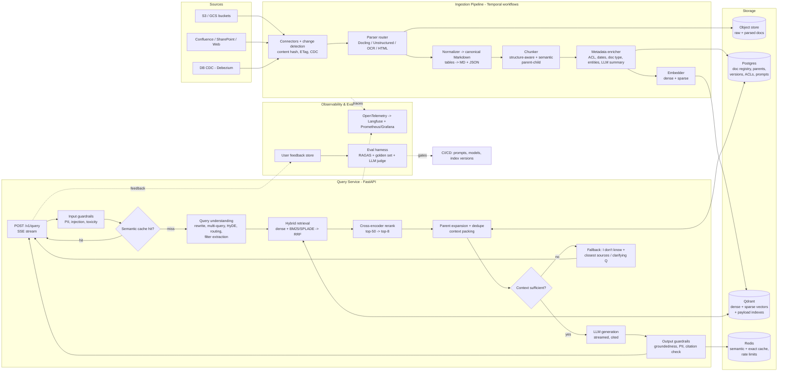

# grounded-rag — Architecture & Implementation Plan

## Context
This is a new system built from scratch; there is no existing codebase to reuse. The goal is a production RAG service, not a prototype. It must keep p95 latency low, return answers grounded in sources with citations, be observable from end to end, and reflect source changes within minutes. This document sets the architecture, the main query API contract, the tech stack and a 4-phase rollout. Phase 1 builds on this design.

**Assumptions** (all can be changed):
- Python backend.
- Cloud-agnostic, running on containers and Kubernetes.
- Claude as the generation LLM.
- Multi-tenant document corpora, with roughly 1M–50M chunks per deployment.

---

## 1. End-to-End Architecture



---

## 2. Data Ingestion & Indexing Pipeline

### 2.1 Orchestration and freshness
- Ingestion runs as **Temporal** workflows, one per document. Each workflow does fetch → parse → chunk → enrich → embed → upsert. Activities are idempotent and retry with backoff. Temporal gives durable retries and replay, which plain Celery does not.
- **Change detection**: each connector emits `DocumentChanged(doc_id, version, content_hash)`. If the hash is unchanged, the pipeline skips the document. If it changed, the pipeline re-chunks it and runs a **diff upsert**. Chunk IDs are `hash(doc_id, chunk_text_normalized)`, so unchanged chunks keep their embeddings and only new or changed chunks are re-embedded. Orphaned chunks are deleted.
- **Freshness modes**:
  - Push: webhooks and CDC via Debezium → Kafka.
  - Pull: scheduled crawls as a fallback.
  - Target: changes are searchable within 5 minutes. The `ingest_lag_seconds` metric tracks this.
- **Deletes and ACL changes** jump the queue as high-priority workflows. The vector store must never return a revoked document.

### 2.2 Parsing (messy formats)
A parser router picks the parser by MIME type and a quick content probe:

| Input | Primary | Fallback |
|---|---|---|
| Born-digital PDF | **Docling** (layout model plus TableFormer for tables) | PyMuPDF text |
| Scanned PDF / images | Docling OCR (Tesseract/EasyOCR) | Vision LLM page transcription, for low-confidence pages only |
| HTML | Trafilatura (boilerplate removal) → Markdown | Unstructured |
| DOCX/PPTX/XLSX | Docling / Unstructured | openpyxl for sheets |

- Every parser outputs **canonical Markdown plus a structural tree**: headings, sections, page numbers and bounding boxes for citation highlighting.
- **Tables** are stored two ways:
  1. As Markdown, embedded with a short LLM-written summary ("Table: Q3 revenue by region…").
  2. As JSON in Postgres, so the original table can be shown in answers.
  - Large tables are split by row groups, and each piece repeats the header row.
- **Quality gate**: each document gets a score for the share of non-text characters, OCR confidence and empty pages. Documents below the threshold go to a dead-letter queue for review instead of being indexed silently.

### 2.3 Chunking
Defaults below. The strategy is configurable per corpus.
1. **Structure-aware split first**: split on headings, sections and list or table boundaries from the structural tree, and never split mid-table or mid-code-block.
2. **Semantic sub-split**: sections over 512 tokens are split where the embedding similarity between neighbouring sentences drops (percentile threshold). Child chunks are **~200–400 tokens with 10–15% overlap**.
3. **Parent-child**: child chunks (small and precise) are indexed for retrieval. Each points to a **parent** (the section, up to ~1,500 tokens) stored in Postgres. At query time the matching children are expanded to their parents and deduplicated.
4. **Contextual headers**: before embedding, each child gets a prefix of `doc title > section path` plus a 1-sentence LLM doc summary (contextual retrieval). The prefix is embedded but not shown to the user.

### 2.4 Metadata and tagging
These fields are stored as payload on every chunk and indexed for pre-filtering:
- `tenant_id`, `acl_groups[]` — **mandatory filter**, applied in the vector DB query and never after retrieval.
- `doc_id`, `doc_version`, `source`, `doc_type`, `language`, `created_at`, `updated_at`, `effective_date`.
- `section_path`, `page`, `parent_id`.
- Enriched fields: `entities[]` (spaCy/GLiNER), `topics[]`, `product`, `region`. These are extracted with Haiku-class LLM calls at ingest time and validated against a controlled vocabulary.

### 2.5 Vector database
**Selection criteria**:
- Native hybrid search (dense + sparse in one query).
- Filtered HNSW that keeps recall under selective filters.
- Multi-tenancy.
- Quantization.
- Horizontal sharding.
- Snapshot and restore.
- Self-host or managed options.
- Mature Python client.

**Recommendation: Qdrant.**
- It supports named dense and sparse vectors on the same point, payload indexes, server-side RRF fusion, scalar/binary quantization and sharding with replication.
- Alternatives:
  - pgvector + ParadeDB is fine below ~5M chunks if operational simplicity is the priority.
  - OpenSearch fits if it is already part of the stack.

**Indexing strategy**:
- HNSW with `m=16–32` and `ef_construct=200`, tuned per collection by measuring recall@k against exact search.
- int8 scalar quantization with rescoring, kept in RAM. Original vectors stay on disk.
- Payload indexes on `tenant_id` (marked as tenant key), `acl_groups`, `doc_type` and `updated_at`.
- **Index versioning (blue/green)**: collections are named `corpus_v{N}`. A Qdrant alias `corpus_live` points at the active version. Changing the embedding model means building `v{N+1}` in the background, passing the eval gate, then switching the alias atomically.

---

## 3. Retrieval Strategy

### 3.1 Query understanding
This step makes one Haiku-class call with JSON output, about 150–300 ms, and can run alongside the cache lookup. It produces:
- **Contextualized rewrite**: folds in the conversation history to give a standalone question.
- **Filter extraction**: for example "2024 pricing for EU" → `{year: 2024, region: EU}`, checked against the metadata schema. A filter with low confidence is used as a boost, not a hard filter.
- **Routing**: the query goes to one of `rag` (default), `structured` (text-to-SQL over the table JSON, Phase 4), `chitchat` (no retrieval) or `out_of_scope`.
- **Expansion** (only for complex or multi-hop queries): 2–3 sub-queries, plus HyDE for very short or vague queries.

### 3.2 Hybrid search
- **Dense**: query embedding → kNN, top-50 with ACL and tenant pre-filter.
- **Sparse**: BM25, or SPLADE/BGE-M3 sparse vectors, also top-50 with the same filters. This catches exact IDs, error codes and product names that dense search misses.
- **Fusion**: Reciprocal Rank Fusion (k=60) in Qdrant's query API in a single round trip. The query also boosts recently updated documents (`updated_at` decay) when the corpus marks freshness as important.
- With multiple sub-queries, each is retrieved in parallel (`asyncio.gather`) and the results are merged with RRF.

### 3.3 Re-ranking
- A cross-encoder scores the top ~50 fused candidates down to the **top 8** child chunks.
  - Default: **Cohere Rerank** (managed, multilingual).
  - Self-hosted alternative: **bge-reranker-v2-m3** on GPU (Triton/TEI).
- Budget: under 150 ms at p95. Candidates are truncated to 512 tokens before reranking.
- Rerank scores are stored on the trace. The **top-1 score and the score gap** drive the "sufficient context" decision in 4.2.
- A **per-document cap** (at most 3 chunks from one document) keeps the context diverse.

---

## 4. Generation & Guardrails

### 4.1 Context window management and prompt construction
- **Parent expansion**: children are expanded to parents, overlapping parents are merged, and documents are ordered by rerank score. The most relevant chunks go at the start and end, which avoids the "lost in the middle" effect.
- **Token budget**:
  - System prompt ≈ 1k tokens.
  - History, summarized beyond 3 turns, ≤ 1.5k.
  - Retrieved context ≤ 8–12k, adjustable per tier.
  - Output reserve 1–2k.
  - The packer counts with the model's tokenizer and drops the lowest-ranked chunks first.
- **Prompt structure**: the system prompt is versioned in Postgres or Git and holds the rules, the citation format and the refusal policy. Context goes in as `<source id="S3" title=".." url=".." updated="..">…</source>` blocks, followed by the user question.
- The model must cite as `[S3]` and must answer only from the sources.
- The static system prompt prefix is cached with provider prompt caching to cut cost and time-to-first-token.
- **Models**:
  - Generation: `claude-sonnet-5`.
  - Rewrite, guardrails and enrichment: `claude-haiku-4-5`.
  - Calls go through a thin provider interface, so models can be swapped or A/B-tested.

### 4.2 Fallback ("I don't know")
There are three layers:
1. **Pre-generation gate**: if the top rerank score is below the threshold τ (calibrated on the golden set) or no chunks are found, the LLM is skipped. The service returns `answer_type=insufficient_context` with a short message and the 3 closest sources as "possibly related". It may also ask a clarifying question when the query was ambiguous.
2. **In-prompt policy**: the model is told to answer `INSUFFICIENT_CONTEXT`, or to give a partial answer that states what is missing.
3. **Post-generation groundedness check** (see 4.3): if claims are unsupported, the service either removes the unsupported sentences or replaces the answer with the fallback, depending on the mode.

Degraded modes:
- If the reranker is down, the service uses RRF order only.
- If the primary LLM is down, it retries once, then switches to the secondary model.
- If the vector DB is down, it falls back to BM25-only search on a read replica.

Each degraded mode sets `degraded: true` in the response.

### 4.3 Guardrails
| Stage | Check | Implementation | Latency |
|---|---|---|---|
| Input | PII detection/redaction | Microsoft Presidio, plus custom recognizers for internal IDs | ~10 ms |
| Input | Prompt injection / jailbreak | Classifier (e.g., Llama Prompt Guard), plus heuristics | ~30 ms |
| Input | Toxicity / policy | Haiku classifier or Llama Guard; runs in parallel with query understanding | parallel |
| Retrieval | Injection in *documents* | Treat retrieved text as data and wrap it in delimiters; flag at ingest any documents with instruction-like patterns | ingest |
| Output | Citation validity | Every `[Sx]` must point to a supplied source; strip invalid ones | ~1 ms |
| Output | Groundedness | NLI or Haiku judge on sentence→source pairs; **async/sampled** in streaming mode, **blocking** in strict mode | 200–500 ms |
| Output | PII leakage | Presidio on the output stream, buffered per sentence | ~10 ms |

### 4.4 Streaming
- The service streams over **Server-Sent Events**:
  - `retrieval` event first: sources, so the UI can show citations right away.
  - Then `token` deltas.
  - Then a `final` event with citations, usage and trace_id.
- Output guardrails run on a **sentence-buffered stream**: each sentence is held for ~1 sentence of delay, checked for PII and citations, then released.
- Latency targets:
  - TTFT p95 < 1.5 s.
  - First `retrieval` event p95 < 600 ms.
  - Full answer p95 < 6 s.

---

## 5. Main Query API Contract (REST + SSE)

`POST /v1/query`
- Auth: `Authorization: Bearer <JWT>`. Tenant and ACL groups come **from the token claims, never from the request body**.
- Headers: `Accept: text/event-stream` (streaming) or `application/json` (blocking). `Idempotency-Key` is optional.

**Request**
```json
{
  "query": "string, 1..4000 chars, required",
  "conversation_id": "uuid | null",
  "history": [{"role": "user|assistant", "content": "string"}],
  "filters": {
    "doc_type": ["policy", "faq"],
    "source": ["confluence"],
    "updated_after": "2025-01-01T00:00:00Z",
    "metadata": {"region": "EU"}
  },
  "options": {
    "top_k": 8,
    "mode": "balanced | strict | fast",
    "include_sources": true,
    "use_cache": true,
    "language": "auto",
    "max_output_tokens": 1024
  }
}
```
- `mode`:
  - `fast` skips query expansion and runs async grounding.
  - `balanced` is the default.
  - `strict` runs blocking groundedness checks and uses a higher τ.
- Unknown fields → 422 (`extra="forbid"`).

**Response (`application/json`, 200)**
```json
{
  "request_id": "uuid",
  "trace_id": "hex",
  "answer_type": "answer | partial | insufficient_context | refused | clarification",
  "answer": "Markdown text with [S1] citations",
  "citations": [
    {"id": "S1", "doc_id": "string", "chunk_id": "string", "title": "string",
     "url": "string", "page": 4, "section_path": "Pricing > EU",
     "snippet": "string", "score": 0.91, "updated_at": "RFC3339"}
  ],
  "related_sources": [ /* same shape, for fallback */ ],
  "grounding": {"score": 0.94, "unsupported_sentences": 0, "checked": true},
  "usage": {"input_tokens": 6123, "output_tokens": 412, "cached_input_tokens": 1024},
  "timings_ms": {"guard_in": 35, "query_understanding": 210, "retrieval": 95,
                 "rerank": 120, "ttft": 980, "total": 3400},
  "cache": {"hit": false, "type": null},
  "model": "claude-sonnet-5",
  "prompt_version": "answer-v12",
  "index_version": "corpus_v7",
  "degraded": false
}
```

**SSE stream (`text/event-stream`)**: events in order:
```
event: meta        data: {"request_id","trace_id","cache":{"hit":false}}
event: retrieval   data: {"citations":[...]}            # before generation
event: token       data: {"delta":"..."}                # 0..n
event: guardrail   data: {"action":"redacted|removed_sentence","detail":"..."}  # optional
event: final       data: { the full JSON response above; "answer" is authoritative (fallback or cleaned-up text) }
event: error       data: {"code","message","retryable"} # terminal, replaces final
```
The client may cancel by closing the connection. The server then stops the LLM call.

**Errors** use RFC 7807 `application/problem+json`:

| Status | Meaning |
|---|---|
| 400 | Invalid input |
| 401 / 403 | Authentication or authorization failure |
| 413 | Query too long |
| 422 | Schema violation |
| 429 | Rate limited, with `Retry-After` |
| 503 | Dependency down and no degraded path available |

**Feedback endpoint**: `POST /v1/feedback` with body `{request_id, rating: up|down, reason_codes[], comment, corrected_answer?}` → 202.

**Admin endpoints** (separate service): `POST /v1/ingest/documents`, `DELETE /v1/documents/{id}`, `GET /v1/ingest/jobs/{id}`, `POST /v1/indexes/{version}/promote`.

---

## 6. Production Operations & Observability

### 6.1 Evaluation
- **Golden dataset**:
  - Start with 300–500 question/answer/source triples per corpus.
  - Sources: SME-written questions, mined real queries, and synthetic questions from RAGAS testset generation that SMEs then review.
  - The set is stratified by query type (factual, multi-hop, table, no-answer, adversarial) and versioned in Git with DVC.
- **Metrics**:
  - Retrieval: recall@k, MRR, nDCG against labelled source chunks.
  - Generation: RAGAS faithfulness, answer relevancy, context precision and context recall.
  - Citation accuracy.
  - Correct-refusal rate on no-answer items.
  - Latency and cost per query.
- **Tooling**: RAGAS for metrics, a custom pytest harness, and Langfuse datasets for run comparison. TruLens is optional and not required.
- **Continuous testing**:
  - Every PR that touches prompts, retrieval parameters, models or chunking runs the eval on a 100-item smoke subset. Merging is blocked on a regression greater than X% on any key metric.
  - The full set runs nightly and before every index promotion.
  - Production traces are sampled at 1–5% for online LLM-judge scoring of faithfulness and relevance.
  - Thumbs-down traces go to a review queue and, once triaged, into the golden set.

### 6.2 Tracing and telemetry
- **OpenTelemetry** wraps every stage in a span, carrying latency, input and output sizes, and scores:
  - `guard.input`, `cache.lookup`, `query.understand`, `retrieve.dense`, `retrieve.sparse`, `fusion`, `rerank`, `context.pack`, `llm.generate` (TTFT, tokens, cost), `guard.output`.
- Traces are exported to **Langfuse**, self-hosted, which shows LLM-aware traces with prompt versions and links feedback to traces.
- Metrics are exported to **Prometheus/Grafana**.
- Logs are structured JSON, correlated by trace_id, and have PII redacted.
- **Key SLOs and dashboards**:
  - p50/p95 for each stage.
  - TTFT.
  - Cache hit rate.
  - Fallback rate.
  - Groundedness score distribution.
  - Thumbs-down rate.
  - Tokens and cost per tenant.
  - `ingest_lag_seconds`.
  - DLQ depth.
- Alerts fire when the fallback rate spikes, which usually means an index problem.

### 6.3 Caching
| Layer | Key | TTL / invalidation |
|---|---|---|
| Exact response cache | `hash(tenant, acl_hash, normalized_query, filters, prompt_ver, index_ver)` | 24 h; keys change automatically when the index or prompt version changes |
| **Semantic cache** | embedding of the rewritten query, searched in Redis (RedisVL) scoped by tenant + ACL hash | Cosine ≥ 0.95 (tuned on the golden set to keep false hits under 1%). Entries store `doc_ids[]`; a doc update evicts the entries that reference it |
| Embedding cache | `hash(model, text)` | Long TTL; saves re-embedding cost |
| Retrieval cache | `hash(query_vec_bucket, filters)` → candidate IDs | 5–15 min |
| LLM prompt cache | Provider-side prefix caching for the system prompt | automatic |

- The semantic cache is **only used for answers with grounding score ≥ threshold**.
- It is skipped for queries that depend on conversation context, or when `use_cache=false`.

### 6.4 CI/CD
- **Prompts as code**:
  - Prompt templates live in `prompts/*.yaml` with semantic versions.
  - On deploy they are loaded into a Postgres registry.
  - The active version can be selected per tenant or experiment.
  - A/B testing uses a hash of the user ID to assign a bucket.
- **Pipeline** (GitHub Actions):
  1. Lint, type-check (mypy) and run unit tests.
  2. Run contract tests against the OpenAPI schema.
  3. Run the eval smoke test on an ephemeral stack (docker-compose with a fixture corpus).
  4. Build the container, deploy to staging and run the full eval.
  5. Canary rollout (Argo Rollouts) gated on SLO and eval metrics.
- **Index updates**:
  - Incremental updates flow through the ingestion workflows continuously.
  - *Breaking* changes (new embedding model or chunking strategy) build a new `corpus_v{N+1}`, pass the eval gate, then switch the alias.
  - The old version is kept for 7 days as a rollback target.
- **Infrastructure**: Terraform, Kubernetes with Helm. Qdrant snapshots go to object storage nightly.

---

## 7. Tech Stack

| Concern | Choice | Why |
|---|---|---|
| API | **Python 3.12, FastAPI, Pydantic v2, uvicorn**, httpx async | Async I/O fan-out, strict schemas, OpenAPI generation |
| Orchestration (ingest) | **Temporal** | Durable, retryable, observable workflows |
| Eventing | Kafka (or Redpanda); Debezium for CDC | Push-based freshness |
| Parsing | Docling, Trafilatura, Unstructured (fallback), Tesseract | Layout and table fidelity |
| Embeddings | Voyage (`voyage-3.x`) **or** self-hosted BGE-M3 (dense + sparse) via HF TEI | One model gives both vector types if self-hosted |
| Vector DB | **Qdrant** | Native hybrid, filtering, quantization, aliases |
| Relational | **Postgres 16** (SQLAlchemy 2 + Alembic) | Doc registry, parents, prompts, feedback |
| Cache | **Redis Stack** / RedisVL | Semantic and exact cache, rate limiting |
| Reranker | Cohere Rerank or bge-reranker-v2-m3 (TEI) | Top-k precision |
| LLM | Anthropic SDK direct: `claude-sonnet-5`, `claude-haiku-4-5` | No heavy framework; a thin internal `LLMProvider` protocol |
| Guardrails | Presidio, Llama Prompt Guard / Llama Guard, custom NLI judge | Composable, self-hostable |
| Eval | RAGAS, pytest, Langfuse datasets | CI-gatable |
| Observability | OpenTelemetry, Langfuse, Prometheus, Grafana, Loki | LLM-aware and system-wide |
| Infra | Docker, Kubernetes, Helm, Terraform, Argo Rollouts, GitHub Actions | Standard |

**What to avoid**: LangChain and LlamaIndex as the core runtime. Their hidden prompts and layers of indirection make latency tuning and tracing harder. Small utilities from them, such as text splitters for comparison, are fine to use selectively.

**Proposed repo layout**
```
grounded-rag/
  services/query/        # FastAPI app: api/, pipeline/ (guard, understand, retrieve, rerank, pack, generate), providers/
  services/ingest/       # Temporal workflows + activities: connectors/, parsers/, chunking/, enrich/, embed/
  libs/core/             # shared schemas, tokenizer utils, telemetry setup, config
  prompts/               # versioned YAML prompt templates
  eval/                  # golden datasets (DVC), harness, metrics, CI gate scripts
  deploy/                # helm charts, terraform, docker-compose for local
```

---

## 8. Four-Phase Implementation Plan

### Phase 1: Baseline (about 3–4 weeks)
**Goal**: a correct, traced RAG loop running end to end.
- docker-compose stack: FastAPI, Postgres, Qdrant, Redis, Langfuse.
- Ingestion: batch CLI that reads S3 or a folder, parses with Docling, chunks recursively (structure-aware), embeds densely and upserts with `tenant_id`/ACL payload.
- Query: dense top-k, simple prompt with citations, SSE streaming, `/v1/query` contract implemented in full (fields not yet used return defaults).
- OTel tracing to Langfuse. JWT auth with tenant and ACL filtering.
- Golden set v0 (~100 items) and a RAGAS script run by hand to set the **baseline numbers**.

**Exit criteria**: contract tests pass; baseline faithfulness and recall@8 are recorded; p95 is under 5 s.

### Phase 2: Retrieval quality (about 3–4 weeks)
**Goal**: raise recall and precision, measured against the baseline.
- Sparse vectors plus RRF hybrid search, and the cross-encoder reranker.
- Parent-child chunking with contextual headers and semantic sub-splitting. Table handling (Markdown + JSON + summaries).
- Metadata enrichment and filter extraction. Query rewrite with history and routing.
- Eval in CI (smoke-test gate). Golden set grows to 300+ items, including no-answer and table queries.

**Exit criteria**: at least +15% recall@8 and +10% faithfulness over Phase 1 on the golden set; rerank p95 under 150 ms.

### Phase 3: Production hardening (about 3–4 weeks)
**Goal**: safe, reliable and fresh.
- Input and output guardrails (Presidio, injection classifier, citation validation, groundedness check for strict mode).
- Fallback ladder: the τ gate, `insufficient_context` responses and degraded modes with circuit breakers.
- Temporal ingestion with connectors, hash diffing, CDC/webhooks, priority deletes and the dead-letter queue.
- Rate limiting, idempotency, RFC 7807 errors, the feedback endpoint.
- Grafana SLO dashboards and alerts. Load test with k6 at the target QPS.
- Blue/green index versioning with alias promotion.

**Exit criteria**:
- Ingest lag p95 under 5 minutes.
- Correct-refusal rate at least 90% on no-answer items.
- Zero cross-tenant leaks in the ACL test suite.
- SLOs hold under 2× expected load.

### Phase 4: Advanced optimization (ongoing)
**Goal**: cost, latency and continuous improvement.
- Semantic cache with doc-based invalidation, embedding cache, prompt caching.
- Multi-query and HyDE for complex queries, gated by the router. Text-to-SQL route for structured or table data.
- Model tiering: Haiku for simple queries, Sonnet for complex ones, chosen by the router. Quantization tuning. Optionally self-host the reranker and embeddings on GPU.
- Online eval sampling, a feedback → golden set loop, prompt A/B tests, canary deploys gated on eval.
- Optional fine-tuned embeddings or reranker trained on mined hard negatives from feedback.

**Exit criteria**: cost per query down at least 30% with no quality regression; cache hit rate above 20% where the workload allows.

---

## 9. Verification (how we'll prove each phase works)
- **Contract**: schemathesis property tests against the generated OpenAPI spec, and SSE event-order tests.
- **Quality**: `make eval` runs RAGAS plus the retrieval metrics on the golden set, and its output is compared with the stored baseline JSON. CI fails on regression.
- **Security**:
  - ACL leak suite: users with disjoint groups query the same corpus, and the tests assert that no foreign doc_ids appear.
  - Prompt-injection corpus run against both input and documents.
  - PII redaction tests.
- **Freshness**: an end-to-end test edits a document in a source bucket and polls `/v1/query` until the new fact appears. It asserts the lag is under the SLO, and that a deleted document disappears.
- **Performance**: a k6 load test at 1× and 2× target QPS checks the per-stage p95 from the trace data, and chaos tests kill the reranker, the LLM and Qdrant to confirm the degraded paths.
- **Local smoke**: `docker compose up` → ingest the fixture corpus → curl `/v1/query` with `Accept: text/event-stream` → confirm the trace appears in Langfuse.
